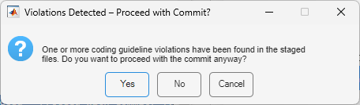

# CC4M-githooks

To maintain high code quality in your repository, it's helpful to run a static code checker before committing changes. In this repository, files are stored for automating a CC4M run on your MATLAB code using a pre-commit hook.

We'll integrate CC4M (Code Checker for MATLAB) into a Git pre-commit hook to automatically verify code compliance against the guidelines before allowing it to be committed. Here’s how it works:

* When you commit changes, the pre-commit hook first runs CC4M.
* If no issues are found, the commit proceeds.
* If violations are detected, the report is shown and using a dialog the commit can either be canceled, or allowed anyway.

## Prerequisits
In order to be able to use this pre-commit hook, your system needs:
* MATLAB
* CC4M
* Python (supported by used MATLAB installation, see [link](https://nl.mathworks.com/support/requirements/python-compatibility.html).
* GIT

## Installation

By default, the pre-commit hook runs CC4M in a separate MATLAB session, which is kept alive. Every time files need to be checked, via Python and the matlabengine module, a CC4M run is executed in this MATLAB session. To be able to do so, a Python environment is created with the [matlabengine](https://pypi.org/project/matlabengine/) installed. As the matlabengine is specific to the MATLAB release - and the code needs to be available from the pre-commit hook, an install procedure is available:

1. Clone this repository
2. Open MATLAB with CC4M installed
3. Browse in the local working copy to the folder [matlab](./matlab)
4. Run install.m
    - Creates a Python environment in `fullfile(userpath(), 'cc4m', 'python')`
    - Installs the matlabengine package from PyPi
    - Adds MATLAB files to `userpath()`
5. Copy the file `pre-commit` to the folder _'./.git/hooks'_ for all the local repositories you like to equip with the pre-commit action.

## Use

After the installation procedure, every commit will trigger a CC4M run on all MATLAB files that are part of the commit. The first check takes more time, as a new MATLAB session is started using the `matlabengine`. This session will be reused with the following commits.

When all checks pass, the files will be committed. In case of violations, you can still enforce a commit; just select "Yes" from te dialog that pops up.

### Connect with open development session.

You can reuse the MATLAB session you have open already, by sharing the engine with the name "CC4M_MATLAB_SESSION" or runnning `cc4m_connectpy()` .

# Links

* Repository on GitHug:  [https://github.com/MonkeyProof-Solutions-BV/CC4M-githooks](https://github.com/MonkeyProof-Solutions-BV/CC4M-githooks)
* Details explanation in [blog](https://monkeyproofsolutions.nl/about/blog/cc4m/using-githooks)